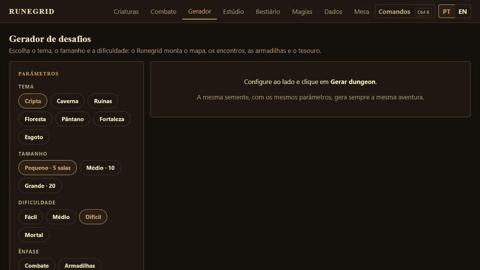
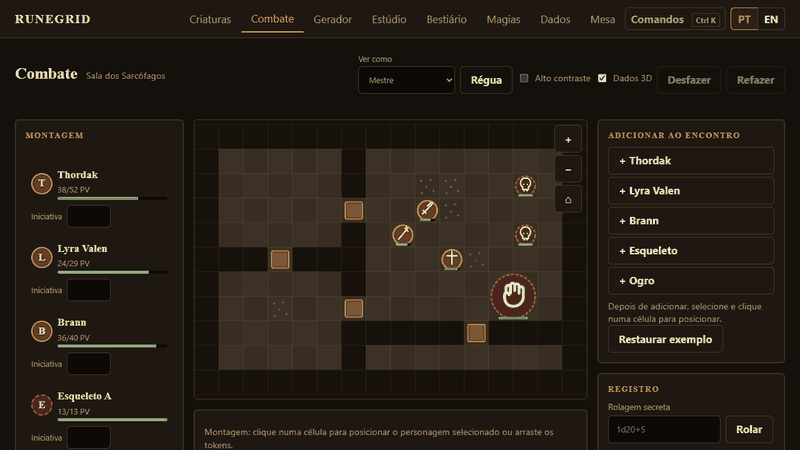

# Runegrid — mesa virtual de D&D 5e

Combate em grade com **Mestre autoritativo**, **dados 3D**, editor de dungeons, **gerador de desafios** por tema/terreno/tamanho e **multiplayer P2P com voz** — sem backend.
Feito em **Angular 22** (standalone, signals, zoneless, OnPush). Plano e backlog completos em [PLANO.md](PLANO.md).

**[Abrir a demo](https://runegrid-nine.vercel.app)**

## Em ação

**Gerador reproduzível, com texto por IA opcional**



**Combate tático com iniciativa, mapa e economia de ações**



## O que tem

| Área        | Destaques                                                                                                                                                                                                                                                                |
| ----------- | ------------------------------------------------------------------------------------------------------------------------------------------------------------------------------------------------------------------------------------------------------------------------ |
| Regras 5e   | Movimento (terreno difícil, diagonais, cantos, criaturas grandes), iniciativa, ações, ataques (crítico, vantagem, Ataque Extra), 14 condições, concentração, magias (espaços, upcast, áreas, salvaguardas), ataques de oportunidade, armadilhas, portas, névoa de guerra |
| Dados       | Parser `NdM`/`kh`/`kl`/`d%`, RNG com semente, rolagem **3D** (three.js + cannon-es, carregada sob demanda) com o resultado sempre lido na face de cima, fallback 2D, cor por tipo de dado                                                                                |
| Mestre      | Estúdio de mapas (pincel, salas, armadilhas, texturas), biblioteca de dungeons, gerador de aventuras reproduzível por semente e texto por IA opcional, bestiário e magias do SRD (322 monstros, 319 magias)                                                              |
| Jogadores   | Controlam só as próprias criaturas, dentro das regras; o Mestre valida tudo                                                                                                                                                                                              |
| Multiplayer | WebRTC via PeerJS (host = Mestre, código de 6 letras), chat, sussurro, chat de voz (mudo, push-to-talk, volume por pessoa)                                                                                                                                               |
| Itens       | Catálogo do SRD, equipar armadura/escudo/arma altera CA e ataques, peso, poções que gastam a ação                                                                                                                                                                        |
| Qualidade   | 343 testes, Lighthouse 100 (acessibilidade/boas práticas/SEO), modo alto contraste, PWA instalável e offline                                                                                                                                                             |

## Arquitetura

```
core/models   tipos puros (Creature, GridMap, EncounterState…)
core/rules    regras em TS puro, sem Angular: dice · creature · grid · encounter · spells · generator · inventory
state         stores com signals (party, encounter, dice, srd, ui-prefs)
net           PeerJS: sala, protocolo, voz · OpenAI opt-in para texto do gerador
features      telas lazy: combate · criaturas · estúdio · gerador · bestiário · magias · dados · mesa
```

Fluxo central: toda mudança é um **Comando** → `dispatch(state, cmd, {rng, role})` → novo estado imutável + log. O mesmo `dispatch` roda no navegador do Mestre; jogadores só enviam comandos.

## Decisões (ADRs)

1. **Regras fora do Angular.** `core/rules` não importa framework: testa-se em milissegundos e o núcleo é reaproveitável. _Custo:_ uma camada de stores para ligar tudo.
2. **Estado imutável + Comando/Evento.** Desfazer/refazer, log e sincronização vêm de graça; `RuleError` vira mensagem ao usuário, não exceção perdida.
3. **Mestre autoritativo, sem servidor.** O host valida todo comando (`authorize`) e envia a cada jogador uma **projeção** (`project`) do estado: tokens ocultos, névoa, log secreto e PV inimigo (só em %) nunca saem do host. Trocou Supabase por PeerJS: custo zero e sem conta. _Custo:_ a sala pausa se o Mestre sai e os jogadores reconectam após ele restaurar o snapshot; NAT restritivo depende do TURN público.
4. **Dados 3D reproduzíveis.** A física roda uma vez (cannon-es), grava os quadros e reproduz; as faces são renomeadas para que a de cima seja o valor do motor. O resultado nunca depende da animação, e todos veem a mesma rolagem.
5. **Bundle pequeno.** three, cannon-es e PeerJS são `import()` dinâmicos; o shell fica ~250 kB.
6. **Conteúdo do SRD 5.1 (CC-BY-4.0)** importado por script versionado (`scripts/import-srd.mjs`), não em runtime.
7. **Signals + zoneless + OnPush** em todos os componentes; `@let` e control flow nativo.
8. **IA somente opt-in e BYOK.** O gerador pode reescrever gancho e descrições, e o Estúdio sugere cenas e intenções de PNJ via Responses API. A chave informada pelo Mestre permanece apenas no campo da página, nunca vai para storage, e a requisição usa `store: false`; sugestões só são aplicadas por ação explícita do Mestre.
9. **Interoperabilidade VTT.** O Estúdio importa e exporta o subconjunto de cenas Foundry v13 [documentado aqui](docs/FOUNDRY-VTT.md).

## Rodando

```bash
npm install
npm start          # http://localhost:4200
npm run test:ci    # testes (Vitest)
npm run lint
npm run build
npm run e2e
```

O `npm install` ativa o hook de pre-commit versionado, que verifica Prettier e ESLint.

Multiplayer: abra `/mesa`, clique em "Criar sala" e passe o código; outros abrem `/mesa` e entram. Deploy: Vercel a partir da `main` (`vercel.json` com rewrite SPA).

## Limitações conhecidas

- Áudio de voz depende de microfone/permissão e de rede que permita WebRTC.

Conteúdo baseado no SRD 5.1 da Wizards of the Coast, licenciado sob CC-BY-4.0.
